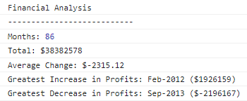

# Console-Finances

## Description

The aim of this project was to take an array of financial data about the monthly profit/loss of a company and use JavaScript to analyse the data. The goal was to find the following:
- total number of months in the array
- net profit/loss over these months
- average monthly change in profit/loss
- identify the month with the greatest increase in profits
- identify the month with the greatest decrease in profits

This data then needed to be displayed in the console log so that the results of the analysis were easy to read and understand. I wanted to do this so that I could improve my understanding of arrays, for loops and if statements in JavaScript. Working on this project was very insightful to all of these and allowed me to develop my understanding of algorithms and counting over arrays using for loops.

This webpage can now be used to analyse different profit/loss arrays of varying lengths with no additional input needed! 

## Installation

N/A

## Usage

To access this webpage, please use the following URL: (https://emma-231925.github.io/Console-Finances/)

Open the console to view the financial analysis of the given data!

Check out the results below: 

## Credits

N/A

## License

Please refer to LICENSE in repo.